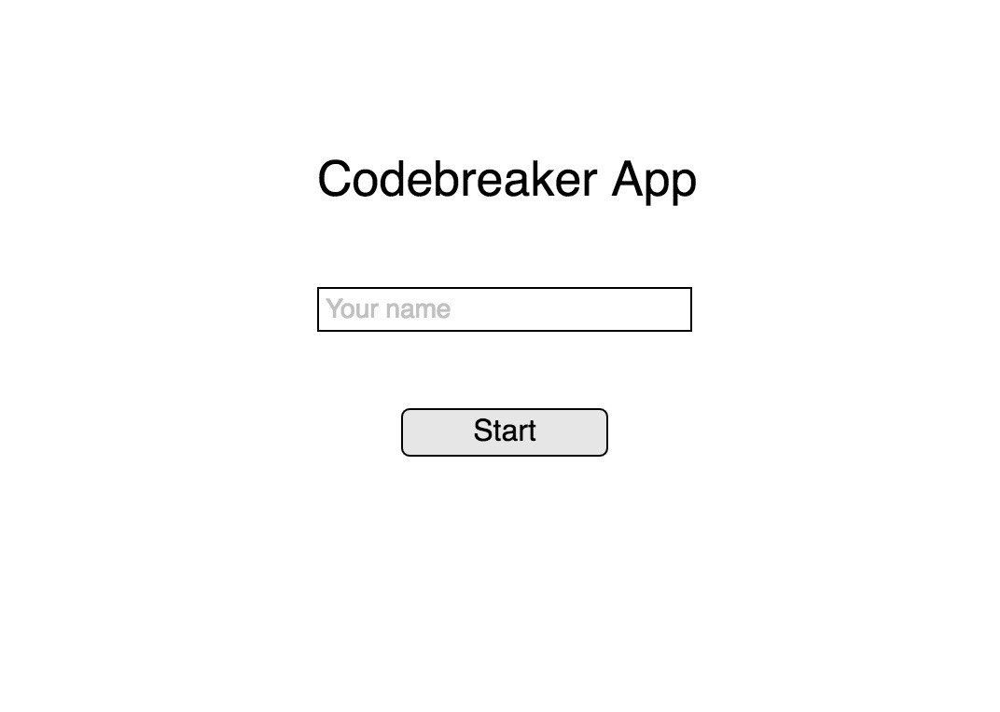
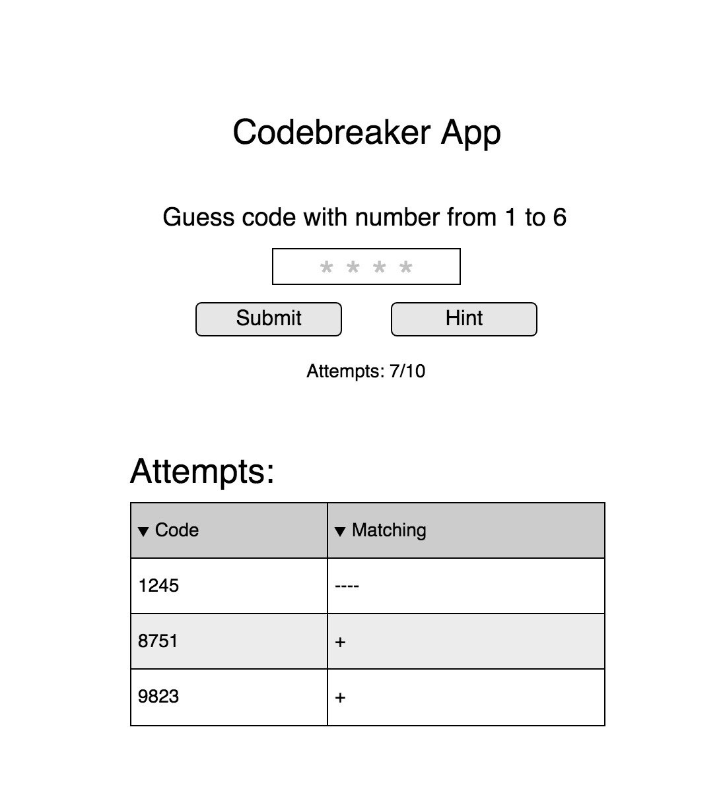
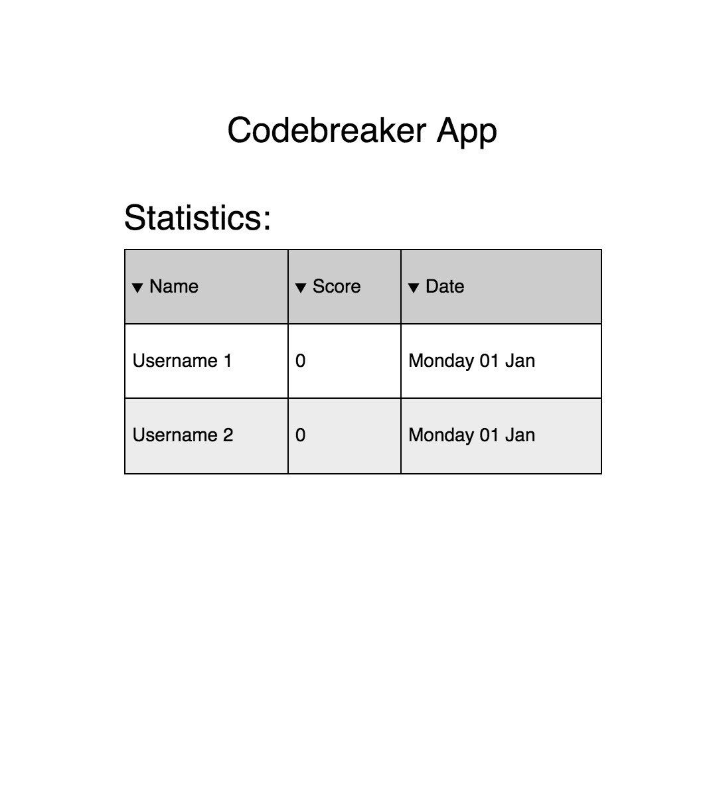

Task
``````````````````````
https://guides.rubyonrails.org/rails_on_rack.html
``````````````````````







В папке с файлом gemfile
``````````````````````
gem install bundler
bundle install
rspec --init
``````````````````````
! Когда обновился какой либо гем то bundle update
``````````````````````
gem install codebreaker
gem install haml
gem install rack
rackup
``````````````````````
в новой вкладке терминала из корневой папки где config.ru
``````````````````````
curl http://localhost:9292
``````````````````````
Или в браузере
``````````````````````
http://localhost:9292/
``````````````````````
Тесты
``````````````````````
rspec spec/app_spec.rb --format doc
``````````````````````
## License

The gem is available as open source under the terms of the [MIT License](https://opensource.org/licenses/MIT).
